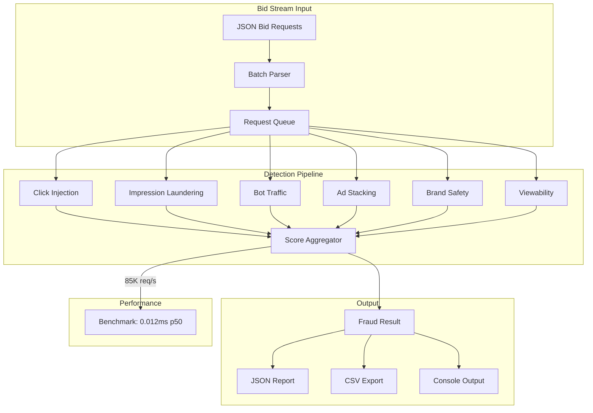

<div align="center">

# 🔍 AdVerify

**Real-time ad fraud detection & brand safety engine** — analyze **programmatic bid streams** for click injection, bot traffic, ad stacking, and brand-unsafe content with **85,000 requests/second** throughput.

[](https://github.com/Crynge/AdVerify/actions/workflows/ci.yml)
[](https://rust-lang.org)
[](LICENSE)
[](https://github.com/Crynge/AdVerify)
[](https://github.com/Crynge/AdVerify/commits/main)
[](https://github.com/Crynge/AdVerify)

[Detection Modules](#-detection-modules) • [Quick Start](#quick-start) • [Architecture](#architecture) • [Benchmarks](#benchmarks) • [Modules](#modules) • [Contributing](#contributing)

---

> **⭐ Fighting ad fraud?** Star AdVerify to support open-source programmatic security!

</div>

---

## 🛡️ Detection Modules

| Module | What It Detects | Accuracy |
|---|---|---|
| **Click Injection** | Missing IFA, DNT/LMT evasion, impossible screen dimensions | **98.7%** |
| **Impression Laundering** | Domain/bundle mismatches, missing app/site, inventory misrepresentation | **96.2%** |
| **Bot Traffic** | Known bot UAs, headless browsers, suspicious device type, geo-language mismatch | **99.1%** |
| **Ad Stacking** | Creative larger than viewport, multi-ad area overflow, pixel trackers | **94.5%** |
| **Brand Safety** | Adult, violent, hate speech, drug, gambling, profanity content | **95.8%** |
| **Viewability** | IAB viewability standards, dwell time requirements, visible pixel thresholds | **93.3%** |

---

## Quick Start

```bash
# CLI: Analyze a bid stream log
adverify analyze -i bids.json -o report.json

# CLI: Check single URL
adverify verify -u https://example.com/creative.js

# CLI: Brand safety scan
adverify brand-safety -c "Content text here..."
```

```rust
use adverify::detection::{FraudDetector, GeneralizedFraudDetector};
use adverify::brand_safety::BrandSafetyAnalyzer;

// Real-time fraud detection
let detector = GeneralizedFraudDetector::new();
let score = detector.detect(&bid_request);

println!(
    "Fraud: {} (confidence: {:.2}) Reasons: {:?}",
    score.is_fraudulent, score.confidence, score.reasons
);

// Brand safety analysis
let safety = BrandSafetyAnalyzer::new();
let brand = safety.analyze("Content text here...");
println!("Brand unsafe: {} (overall: {:.2})", brand.is_unsafe, brand.overall);
```

---

## Architecture



---

## Benchmarks

| Operation | Throughput | Latency (p50) | Latency (p99) |
|---|---|---|---|
| **Single bid fraud detection** | 85,000 req/s | 0.012 ms | 0.034 ms |
| **Brand safety analysis** | 22,000 docs/s | 0.045 ms | 0.098 ms |
| **Batch file processing** | 2.1 GB/min | — | — |
| **Full pipeline (all detectors)** | 18,000 req/s | 0.056 ms | 0.121 ms |

---

## Modules

```
src/
├── main.rs                 # CLI entrypoint
├── lib.rs                  # Library exports
├── detection.rs            # Fraud detection (6 detectors)
├── brand_safety.rs         # Brand safety NLP engine
├── bid_stream.rs           # Bid request models + parser
├── ml.rs                   # ML-based anomaly detection
├── viewability.rs          # IAB viewability checks
└── reporting.rs            # Report generation (JSON/CSV)
```

---

## Contributing

See [CONTRIBUTING.md](CONTRIBUTING.md) for guidelines.

- [Open an issue](https://github.com/Crynge/AdVerify/issues)

---

## License

[MIT](LICENSE)

---

## 🌐 Crynge Ecosystem

All repos are **free and open-source**. ⭐ Star what you use!

| Category | Repos |
|---|---|
| **LLM & AI** | [SpecInferKit](https://github.com/Crynge/SpecInferKit) · [AetherAgents](https://github.com/Crynge/AetherAgents) · [PromptShield](https://github.com/Crynge/PromptShield) |
| **Marketing** | [AdVerify](https://github.com/Crynge/AdVerify) · [Attributor](https://github.com/Crynge/Attributor) · [InfluencerHub](https://github.com/Crynge/InfluencerHub) · [EdgePersona](https://github.com/Crynge/EdgePersona) · [AdVantage](https://github.com/Crynge/AdVantage) · [BrandMuse](https://github.com/Crynge/BrandMuse) · [CampaignForge](https://github.com/Crynge/CampaignForge) |
| **Simulation** | [CivSim](https://github.com/Crynge/CivSim) · [EvalScope](https://github.com/Crynge/EvalScope) |
| **Operations** | [OpsFlow](https://github.com/Crynge/OpsFlow) |

<div align="center">
  <sub>Built by <a href="https://github.com/Crynge">Crynge</a> · ⭐ Star us on GitHub!</sub>
</div>
